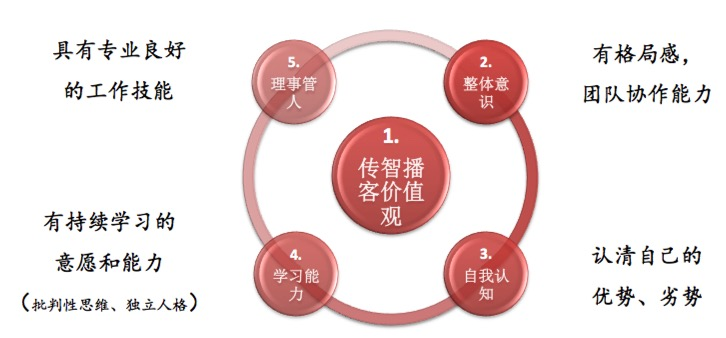

#中坚力量五力模型
##总裁办致辞
要有 **统一的正确的价值观**，正确的价值观就是正确的最终目标，只有目标对了，才不会在挫折中、冲突中迷失方向，统一的目标才会在部门协作、同事合作中正确解决冲突。传智播客的终结目标是探索教育的本源，开辟教育新生态。对应到我们双元课堂android学科，目前首要目标就是提高教学质量，让学生能够良好就业。学生良好就业这个目标是一个多方良好合作的结果，一个是市场人才需求方，一个是参与学习的学生，一个是作为老师的我们。我们老师正好是这个系统的中间人，一方面需要指导学生，一方面要不停的追踪市场需求。

胸怀大局观，就不会被生活琐事困扰
考核中层的方式：离职率、 **部门内部的凝聚力和精神面貌**、跨部门合作

作为中层管理者，不只要 **能合理分配任务，协调部门各成员的工作**，完成部门与部门的配合工作，完成公司目标，还要能 **手把手指导成员完成业务**，客观公正的对待每一位成员，营造一个积极向上、努力奋斗的工作氛围

##传智播客的传承
真正正确的东西是能够经得住时间的检验的东西，能够经得住多种形式多次实践检验的东西。

任何工作内容都应该以工作目标为指导方向，而我们做教育的，最直接的工作目标就是学生的学习效果，无论讲什么，无论怎么讲，评价教学过程好坏的唯一指标就是学习效果，学生学习过程的体验效果，如果说我们提供给学生的是产品，那么学习效果和学习过程的体验效果，就是产品体验，无论做哪个行业，无论做什么方向，只要是做产品，给用户提供品质过硬，体验良好的产品才是赢得用户支持的根本。

我们应该传承传智播客至张老师创校以来的就遵循的以产品品种和产品体验为工作目标的工作态度，传承以张老师在教学过程中摸索出来的良好的教学方式方法。

1. 学员迟到：
    早上有学员迟到时，老师必须提醒该学员，表明学员没着学到老师前面讲解的知识，老师很难过，老师要尽量在中午为学员补课，以真诚感动学员，要让所有学员感到老师这样做很辛苦，要让他们自己感到不好意思迟到。
2. 老师迟到：
    如果老师早上上课因特殊情况迟到了，要诚恳地向全班同学表达歉意，并在下午晚点下课，把迟到耽误的时间补回来，否则，一些比较认真的同学就会有不好的想法和牢骚。
3. 与学员沟通：
    教学贵在沟通，只要 **态度诚恳**和把事情解释清楚，并尽力补偿，同学们也会通情达理的。好的学习结果是老师和学生两方面的事情，**一旦学生对老师有了信任和好感，更有利于学生学好老师所教授的知识**。学员性格各不相同，以免伤害学员的自尊心，有的能听中肯的批评意见，有得则一点都不能容忍别人的苦口良言，所以，老师不要随意评论学员的好坏，而是有策略地引导，只要学员喜爱上了老师，学员就会学好老师教的知识。
4. 提升讲课效果：
    - 中午同学们睡完午觉一般都很累，老师不能不顾及一部分同学的精神状态就自个开始讲课，应该想各种办法让学员头脑清醒后才开始讲课。
    - 下午课程结束前，最好是回顾一下本天讲授内容的重点和亮点。
    - 老师在课堂上不能只管自己讲课，要时刻考虑学员的接受效果，要想到是否有学员没能听进去所讲的内容，即使是只有少部分学员没听进去，信息没有传输到其大脑中，那也等于没讲。特别是由于连续疲劳学习等生理原因可能会有个别学员会在课堂睡觉，如果睡觉的人数达到三个或更多，老师应该及时下课休息和调动课堂的活跃气氛。
7. 课后练习设计：
    - 要注意布置的练习任务是否可行, 老师讲完某一个知识段落后，安排学员练习时，要注意布置的练习任务是否可行？应该时刻想着会不会有一部分同学练不出来？如果是很多同学都做不出来，那么就不能安排练习，以避免耽误时间，应该想办法 **把知识讲解再透彻点，实施步骤总结得再详细点，道理更通俗点**；如果只是一少部分人可能做不出来，那就可以安排练习
    - 要提前想到学员可能会被卡住哪些地方？哪些些小细节很容易让初学人员忽略？明确写下实验步骤和注意事项，以尽力让那一少部分人也可以做出来。
8. 教学目标和教学设计:
    学员每节课的 **学习目标都是要得到实实在在的直观的结果（要么是能够做出东西，要么是能够说出一个系统或功能的运行原理）**，并能够留下深刻印象，学员不关心大道理的说教，只关心某一功能是如何实现的，并希望自己马上能够照着做出来，特别是一些技术亮点的细节要阐述清楚。所以，老师讲课切忌空洞的大概念和术语的泛泛而谈，讲课要干脆利落，直奔主题，重点突出，所讲解的内容一定要有看得见、摸得到的结果，要把自己的程序结果变成学生可以重现的东西。老师不能只想着完成教学任务，要时刻想着一个知识怎么讲解才能够让学员听明白，要时刻站在学员角度去思考，把握学员在本次课堂上最需要的内容到底应该是什么。
9. 细节知识点的教学设计：
    在已经掌握了知识的主要框架以后，对于一些细节知识点，老师应尽量采用 **“错误教学法”**，即通过一些运行错误来引出知识点的讲解，这样更能启发学员们发现问题和思考问题，除了会留下深刻印象外，还锻炼了其解决问题的能力。
10. 学习方法的传授：
    老师在讲解一个新技术和知识点时，要顺带出自己最初是如何掌握这一技术和知识的过程，这就是教授"学习方法"的最好体现。例如，讲解一个API方法时，应该对着API帮助文档进行讲解，讲解Struts/Hibernate/XFire等框架的第一个例子时，由于涉及的步骤和细节稍微多一点，这时候也应该对着这些框架自带的手册进行讲解。本来要做出第一个例子来，可能涉及较多步骤和细节，对于一个刚开始接触这门技术的人来说，要想记下所有步骤和细节是不大可能的事情，所以，这也是令他们非常畏惧和没有信心的事情。但是，如果老师对着技术手册进行解释和演示后，学员们再对着手册去实验，他们不用事先掌握所有细节和步骤，则自己很容易就可以做出来，这样的讲解可以极大增强学员的信心和兴趣，同时也让他们体会到了自己去学习和应用一门新技术的过程。就像一个小孩先必须扶着墙学走路，等到熟练以后自然就可以离开墙走路了，学员只要能够参照手册做出了一个例子，以后做的次数多了，其中的步骤和细节就自然掌握了。对于这样的一些从手册中搬过来的技术细节，老师对着ppt进行讲课，反而达不到更好的效果，因为ppt把老师最初的学习过程给无形中隐藏了，把本来简单的东西弄的高深和复杂了，PPT是总结老师心得的工具，并不是罗列手册中已有内容的魔术道具。
11. 先具体后抽象：
    同学们刚开始对一个新事物的认识和理解能力有限，老师刚开始不易讲解过多的概念，讲解的内容要由浅入深，由简单到复杂，应该直奔主题用代码和动手实验说话，切不可以上来就将简单和复杂的内容放在一起进行介绍和讲解。**学员只有先干出一个基本的东西来后，他们才可以去理解更复杂和更高深的概念，一些高级的知识完全可以在基础知识的基础上通过提问和设置悬念的方式引导出来，这样还可激发学员的一种强烈的学习欲望**。例如，对于一个初次接触化学的学生，你开始不用向他介绍化学中有分子、质子、原子、中子这样的概念，你介绍了，他们也听不懂，等于没讲，最好的方式是上来就做一个最简单的化学实验，随着学习的深入，等到他们有了前面的基础并可以理解后面的内容后，再逐步引入分子、质子、原子、中子这样的理论知识。
12. 提高学员兴趣和信心：
    老师要经常鼓励学员，真心帮助学习提高综合素质，并通过课程内容来激发学员一种保持向上进取的学习热情，例如，许多学员的英语水平普遍不够好，可是英语阅读能力对程序员来说又是非常重要的，所以，在课程中要鼓励同学们阅读英文帮助文档，对新的英语单词要做好笔记，并定期回顾；许多学员学习效率低的原因还在于没有信心，有畏难心理，不敢动手实践，老师要鼓励同学们实践，并帮助同学们实践出效果，这样肯定能提高学员的信心和兴趣。通过在做一些具体案例的过程中来教给同学们学习方法，例如，**对一个新知识，先要记住流程和能够模仿即可，细节在实验和查书的过程中掌握**。一些老师每天的讲课也挺好，但是，只要他单个带课时间一长，课程到了后期，整个班来上课的人数就逐渐变得少了起来，或者是学员学到最后跟不上的东西越来越多，越来越累，而老师又不能调动学员一种强烈的求知欲和学习的胃口，导致一些学员学习到后期就变得自由散漫了。
13. 
    一个高级的软件培训教师，还应该做到能够 **用形象的比喻说明复杂的问题**，用实际操作演示的方式进行讲解说明。**将理论融合到具体的例子中讲解**，知识点尽可能广泛，但又不致令学员感到枯燥无味。课堂中的问题深刻且具有代表性，要保证学员在以后的实际工作中得以运用。
14. 
    总之，软件老师讲课没有特别的技巧，最重要的就是 **实践实践再实践，动手动手再动手，动手前简单说明要做什么和怎么做的思路即可，细节放在做的过程中进行解释，做完以后才能进行高度总结和引出更深入的相关问题**。学员喜欢看老师在舞台上表演，而不是泛泛而谈。我们不仅要交给学员鱼竿和钓鱼的技巧，必要时还得给学员准备一些现成的鱼，以便学员在时间和精力有限的情况下，还是直接将鱼拿过来吃省事和高效。

##五力模型
###五力模型简介

传智播客五力模型，以传智播客价值观为核心，包含整体意识、自我认知、学习能力、理事管人 5个方面

- 价值观：
- 整体意识：有格局感，团队协作能力
- 自我认知：认清自己的优势、劣势
- 学习能力：有持续学习的意愿和能力（批判性思维、独立人格）
- 理事管人：

###五力模型之价值观
传智播客的核心价值观：务实、质量、创新、分享、专注、责任

企业使命：为莘莘学子改变命运而讲课，为千万学生少走弯路而著书

- 短期愿景：改变中国 IT 教育
- 中期愿景：建设成为中国一流的综合性职业教育集团，一流，职业教育界的北大、清华
- 终极愿景：探索教育本源，开辟教育新生态

价值观，是用来判断能够产生价值的事情的正确错误的基本标准。只有具有统一正确的价值观，才能具有统一的判断标准，统一的行为准则

- 务实：以学习效果为目标，以解决问题为方法，为解决问题找方法
- 质量：以质量创造价值，教学的质量，学习的质量
- 创新：用创新产生价值，创新是企业和个人发展持续的动力
- 分享：在分享中产生价值，学习》存储》分享》应用》创新》学习
- 专注：专注于教育，只有专注才能做得更好，更精通
- 责任：对学员负责，对自己负责

奋斗在传智，带着幸福前行，幸福不是享乐，幸福是在奋斗中享受成长的幸福，个人价值体现的幸福

价值观：

- 工匠精神，精耕细作，不人云亦云，精益求精，不投机取巧，以提供满足用户需求的高质量产品为终极一身的追求
- 历史使命感，振兴民族，追求个人价值的实现，这没有问题，但一个民族，总需要有人去仰望星空

###五力模型之整体意识
整体意识包含2方面

1. 配合管理者做好团队工作的协调分工，对于团队中的个体来说，首先需要做好自己的事情，然后还需要有团队整体意识，配合管理者做好团队工作的协调分工，既要能够站在团队其他成员位置看问题，也要能够站在管理者角度看问题，辅助管理者协调团队的合作。
2. 遵循统一的团队目标，工作范围内的事情，当个人目标和团队目标有冲突时，应该遵循团队目标，当和其他同事合作有冲突时，也应该以统一的团队目标作为判断标准。

###五力模型之自我认知
认清自己的优势、劣势，扬长避短

你最后悔的是什么？

    1. 年轻时努力不够，以致事业无成；
    2. 年轻时错误选择了职业，没有做自己擅长的事情；
    3. 对子女教育不够或方法不当；
    4. 没有好好珍惜自己的伴侣；
    5. 锻炼身体不够

人生三大问题:

    + 你和自己的关系
    + 你和周围人的关系
    + 你和世界的关系

###五力模型之学习能力
放弃的借口有很多，坚持的理由只有一个，开放的心态，保持空杯心态，随时随地的学习和提高

##管理学院院规院训及制度规则
院训：
责任融于管理

院规：

- 1） 具备传智播客主人翁精神；
- 2） 尊重制度与规范；
- 3） 做一个表里如一的人；
- 4） 能够无条件执行工作任务；
- 5） 多做利于团队协作的事情；
- 6） 时刻保持对于工作荣誉感的追求；
- 7） 尽职尽责做工作；
- 8） 充满热情的激发他人；
- 9） 不要为失败找理由，只能为成功找方法；
- 10）要拥有奋斗精神！